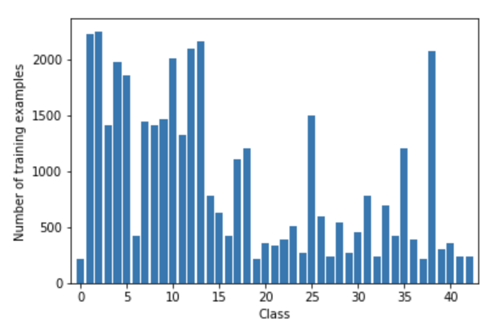
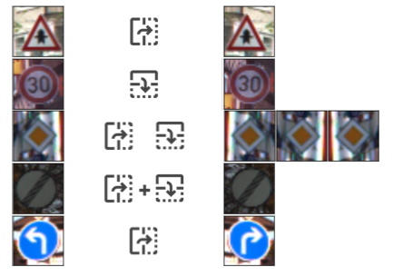
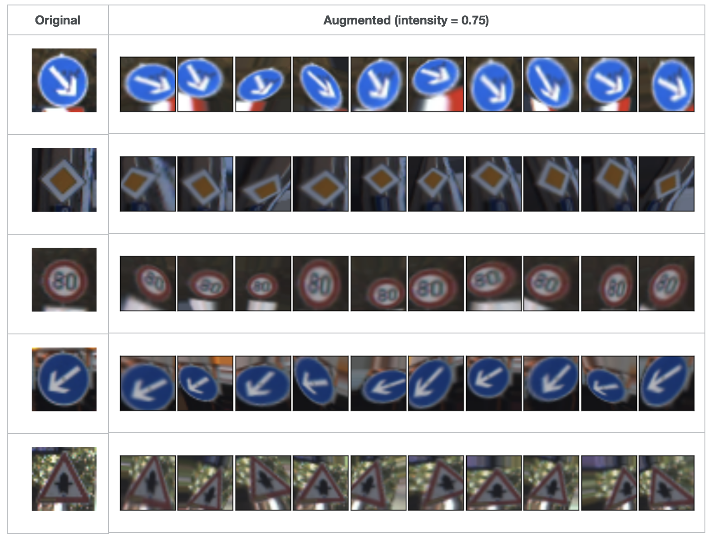
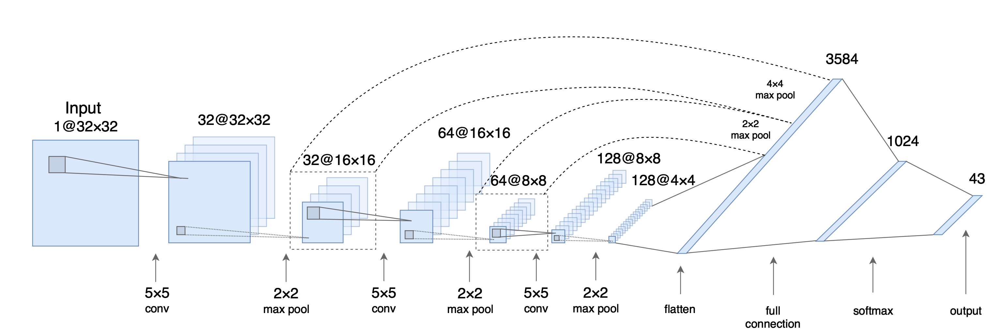

# CarND-TrafficSignClassification

Classification of German traffic signs is one of the assignments in Udacity Self-Driving Car Nanodegree program, the main goal of this project is to classify the German Traffic Sign.

[Ref blog](https://navoshta.com/traffic-signs-classification/)

## Dataset

Dataset is publicly [available here](http://benchmark.ini.rub.de/?section=gtsrb&subsection=dataset), consists of **39,209** 32×32x3 RGB images that we are supposed to use for training, and **12,630 images** that we will use for testing.   Each image is a photo of a traffic sign belonging to one of 43 classes, e.g. traffic sign types.   

The training dataset is unbalanced across classes. Some classes are highly underrepresented, some classes have as little as 210 samples, this won't be enough for most of the models to generalise well.   

### Data Augmentation:

Train increases from 39209 -> flip: 67378 -> Rotation/reflection: 430000 (10000 images each class).   

1. Flip

   Some signs are horizontally and/or vertically symmetrical(like **Bumpy road** or **Ahead only**); Other signs come in kind of interchageable pairs, like **Keep right** and **Keep left**.

   

2. Rotation/reflection(projection)

   

## Training

**Architecture**

> I decided to use a deep neural network classifier as a model, which was inspired by [Daniel Nouri’s tutorial](http://navoshta.com/facial-with-tensorflow/) and aforementioned [Pierre Sermanet / Yann LeCun paper](http://yann.lecun.com/exdb/publis/pdf/sermanet-ijcnn-11.pdf). It is fairly simple and has 4 layers: **3 convolutional layers** for feature extraction and **one fully connected layer** as a classifier.

* Without DataAugmentation, get 90% accuracy in test set, only trained 5-6 epochs.   
* With DataAugmentation, reach 95% accuracy in test set.   

-----

---------------------------------------------Udacity README.md-------------------------------------------------

------

# Lab: Keras Traffic Sign Classification

We've prepared a Jupyter notebook that will guide you through the process of building and training a Traffic Sign Classification network with Keras.

## Instructions

1. Set up your development environment with the [CarND Starter Kit](https://github.com/udacity/CarND-Term1-Starter-Kit/blob/master/README.md)
2. Launch the Jupyter notebook: `jupyter notebook traffic-sign-classification-with-keras.ipynb`
3. Follow the instructions in the notebook

Since this is a self-assesd lab, you can view the solution by running the `traffic-sign-classification-with-keras-solution.ipynb` notebook. Make sure you're only running one notebook at a time.

## Help

Remember that you can get assistance from your mentor, Forums (click the link on the left side of the classroom), or the [Slack channel](https://carnd.slack.com). You can also review the concepts from the previous lessons, or consult external documentation.